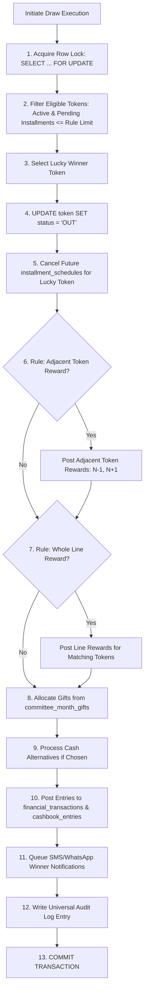
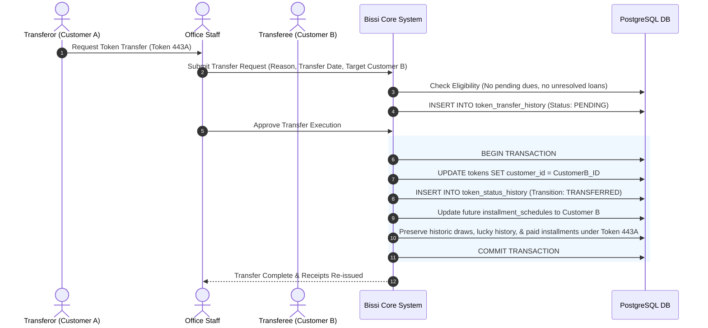
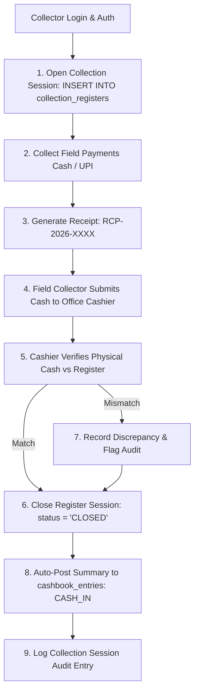
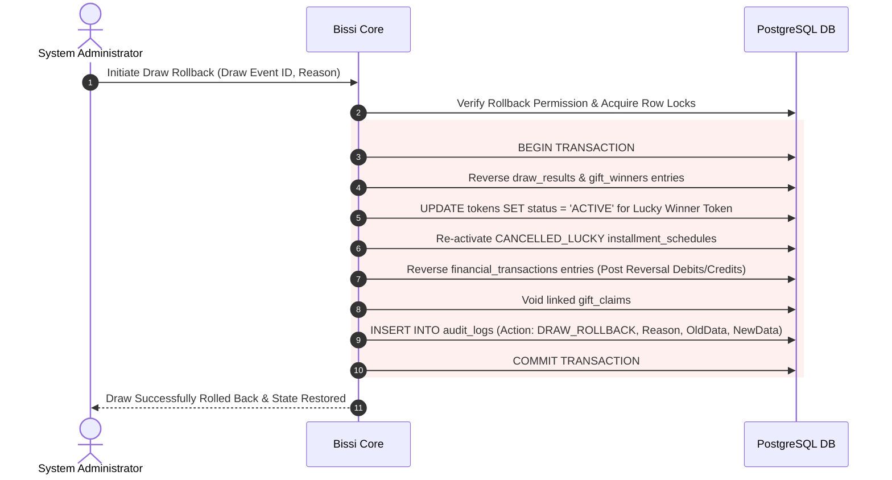
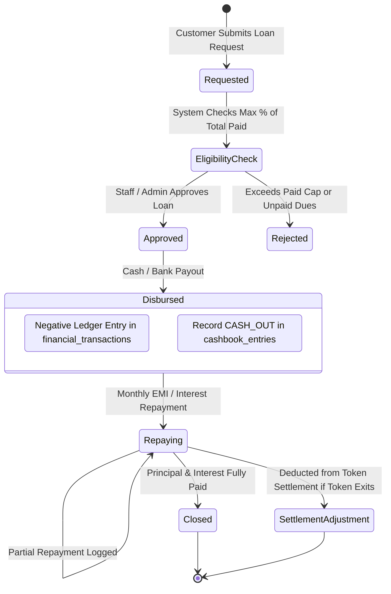
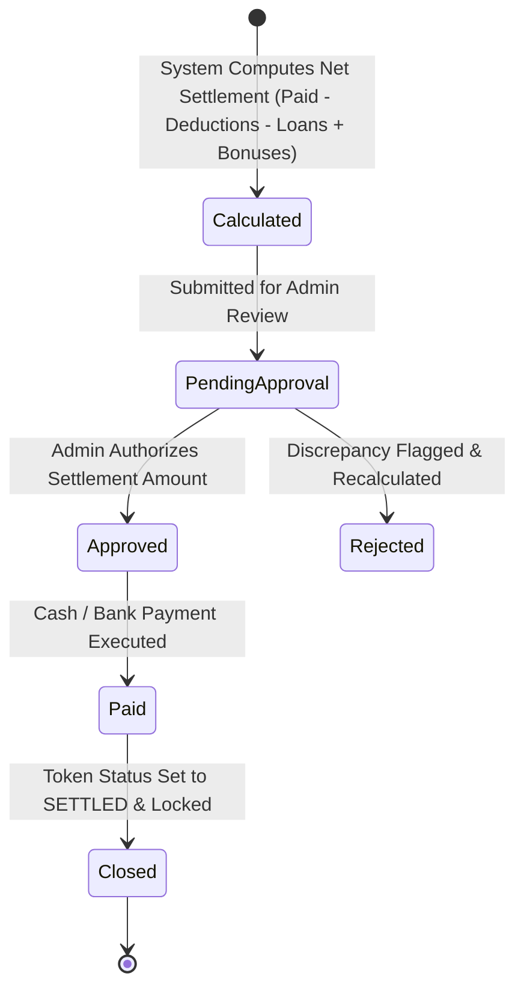
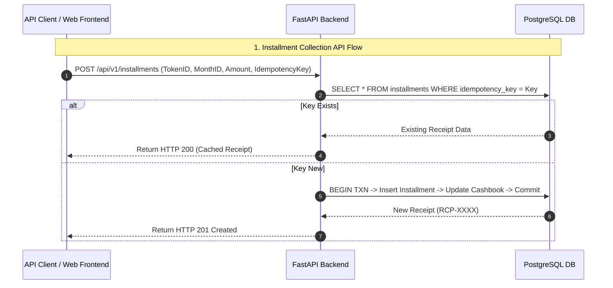

# Enterprise Bissi Management System: Business Workflow & Architecture Document (v2.1)

## Executive Summary
This document defines the single source of truth for all operational rules, financial transaction lifecycles, and database parameters for the **Enterprise Bissi (Committee/BC) Management System**.

---

## 1. Authoritative Business Rule Matrix (Single Source of Truth)

The system utilizes a JSONB Rule Engine (`committee_rules`) allowing per-committee rule execution. The table below represents the authoritative configuration for all 4 primary committees:

| Committee Name | Total Members | Duration (Months) | Monthly Installment | Lucky Draw Rule | Gift Winner Rule | Loan Eligibility | Bonus & Special Rules | Settlement / Exit Rules |
| :--- | :--- | :--- | :--- | :--- | :--- | :--- | :--- | :--- |
| **Hare Ka Sahara** | **500** | **30** | **₹2,500** | Token becomes `OUT`; future installments stop. | Token remains `ACTIVE`; continues installments. | Up to 75% of paid amount at 1% monthly interest. | Gift Guarantee (Every member gets at least 1 gift by Month 15). | Full refund of paid principal at completion; 0% deduction for `OUT` tokens. |
| **Shree Krishna Associates** | **1111** | **30** | **₹3,000** | Token becomes `OUT`; future installments stop. | Token remains `ACTIVE`; receives Gift or Cash. | Up to 80% of paid amount. | Gift Hampers on Month 10 & 20; 100% attendance bonus. | Standard refund minus 5% administrative fee on early exit. |
| **Pyare Mohan** | **500** | **30** | **₹3,000** | Token becomes `OUT`; future installments stop. | Token remains `ACTIVE`; choice of Item or Cash. | Up to 70% of paid amount. | **Adjacent Token Reward**: Tokens $N-1$ and $N+1$ receive ₹500 cash reward. | Early exit deduction of 10% if cancelled before Month 15. |
| **Set Sanwariya** | **500** | **30** | **₹3,000** | Token becomes `OUT`; future installments stop. | Token remains `ACTIVE`; Scooty / Cash option. | Up to 85% of paid amount. | **Whole Line Reward**: All tokens on the same line receive ₹200. **2-Pending Rule**: Blocked if 2+ unpaid. | Special Scooty cash alternative adjustment on final month settlement. |

---

## 2. Rule Engine Single ACID Transaction Execution Order

---

## 3. Token Transfer Workflow

---

## 4. Daily Collection Closing Workflow

---

## 5. Draw Rollback / Undo Workflow

---

## 6. Loan Lifecycle Workflow

---

## 7. Token Settlement Workflow State Machine

---

## 8. Backup, Disaster Recovery & Data Retention Strategy

1. **Point-In-Time Recovery (PITR)**:
   - Supabase Write-Ahead Logging (WAL) enabled with 30-day continuous PITR.
2. **Automated Daily Backups**:
   - Encrypted snapshots created daily at 02:00 UTC and replicated to off-site AWS S3 storage.
3. **Soft Delete & Audit Retention**:
   - Core master data (`customers`, `committees`, `tokens`) utilize soft deletes (`deleted_at TIMESTAMP`). Hard deletes are strictly prohibited.
   - `audit_logs` and `financial_transactions` are immutable and retained for 7 years for compliance.

---

## 9. API Sequence Flows

---

## 10. Excel Import Mapping & Transformation Table

| Excel Column | Database Field | Transformation Rules | Validation Rules | Fallback / Failure Handling |
| :--- | :--- | :--- | :--- | :--- |
| `Member Name` | `customers.name` | Trim whitespace; title case. | Non-empty string; length $\le 100$. | Flag row error if missing. |
| `Father Name` | `customers.father_name` | Trim whitespace; title case. | Optional string. | Store NULL. |
| `Mobile Number` | `customers.mobile` | Remove spaces, dashes, `+91`. Format as 10 digits. | Exactly 10 numeric digits. | Priority match tier 2; flag if invalid format. |
| `Aadhaar No` | `customers.aadhaar` | Strip spaces and hyphens. | 12 numeric digits. | Priority match tier 1. |
| `Token No` | `tokens.raw_token_number` `tokens.normalized_token_number` `tokens.duplicate_suffix` | `29½` $\rightarrow$ `normalized = 29`. Duplicates $\rightarrow$ auto-append `A`, `B`, `C`. | Must yield positive integer base. | Store raw token string; generate suffix on duplicate. |
| `Installment Paid` | `installments.paid_amount` | Parse float/currency symbols (`₹3000` $\rightarrow$ `3000.00`). | Numeric $\ge 0$. | Default to `0.00`. |
| `Payment Date` | `installments.payment_date` | Convert formats (`DD/MM/YYYY`, `YYYY-MM-DD`) to ISO date. | Valid calendar date. | Default to Import Job Date. |

---

## 11. Database Business Rule Validation Constraints

1. **Lucky Draw Re-Entry Prevention**:
   - Unique Partial Index on `draw_results`: `CREATE UNIQUE INDEX idx_unique_lucky_winner ON draw_results(token_id) WHERE reward_type = 'LUCKY_WINNER';`
2. **Gift Winner Active Status**:
   - Trigger check enforcing `tokens.status = 'ACTIVE'` for all non-lucky gift winners.
3. **Token Number Uniqueness**:
   - Unique Composite Index: `UNIQUE (committee_id, normalized_token_number, duplicate_suffix)`
4. **Installment Blocking on OUT Tokens**:
   - `BEFORE INSERT` trigger on `installments` verifying `tokens.status != 'OUT'`, unless override flag `allow_out_payment` is explicitly set in `committee_rules`.
5. **Single Settlement Enforcement**:
   - `UNIQUE (token_id)` constraint on `settlements` table to prevent double payouts.
6. **Financial Transaction Balance Check**:
   - Constraint requiring `amount != 0` and FK link to valid `cashbook_entries` or `installment_id`/`loan_id`.
