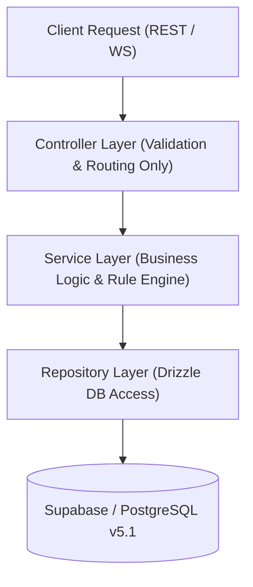

# Implementation Plan: Clean Architecture Refactoring & Repository Cleanup

This implementation plan outlines the refactoring of the Bissi Management System codebase into a production-grade **Clean Architecture Monorepo**. It establishes a clear 3-tier layering model (**Repository Layer**, **Service Layer**, **Controller Layer**), splits the Drizzle database schema into 16 modular files mirroring the frozen PostgreSQL v5.1 DDL, standardizes top-level workspace directories (`apps/`, `packages/`, `scripts/`, `migrations/`, `docs/`), and purges obsolete MongoDB code, root data dumps, and scratch scripts upon explicit user approval.

---

## User Review Required

> [!IMPORTANT]
> **User Approval Required Before File Deletion**: As requested by the user prompt ("*Generate a report before deleting anything. Only after approval perform the cleanup.*"), **NO files will be deleted or modified** until the user reviews and approves this implementation plan and the detailed [repository_audit_report.md](file:///C:/Users/lenovo/.gemini/antigravity-ide/brain/00b7d96d-85e5-411e-a73e-872c585be616/repository_audit_report.md).

---

## Proposed Changes

### 1. Top-Level Directory Restructuring

Reorganize the repository workspace into 5 clean directories:

```text
fintech-project/
├── apps/
│   ├── api/                   # Production Clean Architecture REST & WS Server
│   └── web/                   # Next.js / React Web Application Dashboard
├── packages/
│   └── db/                    # Drizzle ORM Database Schema & Migration Package
├── scripts/                   # Production Maintenance & DDL SQL Scripts
├── migrations/                # Supabase / PostgreSQL SQL Migration Files
└── docs/                      # Business & Architecture Specifications
```

---

### 2. Database Schema Package Split (`packages/db/src/schema/`)

Split the monolithic/legacy Drizzle schema into 16 clean, modular TypeScript files matching the frozen v5.1 PostgreSQL DDL:

- `[NEW]` [customers.ts](file:///c:/Users/lenovo/Desktop/fintech-project/packages/db/src/schema/customers.ts) — Master Customer table & ENUMs
- `[NEW]` [committees.ts](file:///c:/Users/lenovo/Desktop/fintech-project/packages/db/src/schema/committees.ts) — Committees & Committee Rules table & ENUMs
- `[NEW]` [committee_months.ts](file:///c:/Users/lenovo/Desktop/fintech-project/packages/db/src/schema/committee_months.ts) — Committee Months table & ENUMs
- `[NEW]` [tokens.ts](file:///c:/Users/lenovo/Desktop/fintech-project/packages/db/src/schema/tokens.ts) — Tokens & Token Status History table & ENUMs
- `[NEW]` [installments.ts](file:///c:/Users/lenovo/Desktop/fintech-project/packages/db/src/schema/installments.ts) — Installment Schedules & Receipts table & ENUMs
- `[NEW]` [draws.ts](file:///c:/Users/lenovo/Desktop/fintech-project/packages/db/src/schema/draws.ts) — Draw Events & Draw Results table & ENUMs
- `[NEW]` [gifts.ts](file:///c:/Users/lenovo/Desktop/fintech-project/packages/db/src/schema/gifts.ts) — Gift Catalog & Gift Winners table & ENUMs
- `[NEW]` [loans.ts](file:///c:/Users/lenovo/Desktop/fintech-project/packages/db/src/schema/loans.ts) — Loans & Loan Repayments table & ENUMs
- `[NEW]` [settlements.ts](file:///c:/Users/lenovo/Desktop/fintech-project/packages/db/src/schema/settlements.ts) — Final Token Settlements table & ENUMs
- `[NEW]` [finance.ts](file:///c:/Users/lenovo/Desktop/fintech-project/packages/db/src/schema/finance.ts) — Financial Transactions, Cashbook & Expenses
- `[NEW]` [employees.ts](file:///c:/Users/lenovo/Desktop/fintech-project/packages/db/src/schema/employees.ts) — Staff/Collectors & User Organizations
- `[NEW]` [notifications.ts](file:///c:/Users/lenovo/Desktop/fintech-project/packages/db/src/schema/notifications.ts) — SMS/WhatsApp Notifications log
- `[NEW]` [audit.ts](file:///c:/Users/lenovo/Desktop/fintech-project/packages/db/src/schema/audit.ts) — System Audit Logs & Import Engine tables
- `[NEW]` [organizations.ts](file:///c:/Users/lenovo/Desktop/fintech-project/packages/db/src/schema/organizations.ts) — Tenants Master table
- `[NEW]` [relations.ts](file:///c:/Users/lenovo/Desktop/fintech-project/packages/db/src/schema/relations.ts) — Drizzle Relations definitions across all tables
- `[NEW]` [index.ts](file:///c:/Users/lenovo/Desktop/fintech-project/packages/db/src/schema/index.ts) — Central Schema Export Entrypoint

---

### 3. Clean Architecture Layering (`apps/api/src/`)



#### A. Repository Layer (`apps/api/src/repositories/`)
- Encapsulates database queries using Drizzle ORM.
- Repositories: `CustomerRepository`, `CommitteeRepository`, `TokenRepository`, `InstallmentRepository`, `DrawRepository`, `LoanRepository`, `SettlementRepository`, `FinanceRepository`, `EmployeeRepository`.

#### B. Service Layer (`apps/api/src/services/`)
- Implements core business logic:
  - `CustomerService`: 4-tier matching & lossless customer merge
  - `TokenService`: Fraction parsing & token collision normalization (`29½` $\rightarrow$ `29`, `443-A` $\rightarrow$ `443A`)
  - `InstallmentService`: Payment receipt verification & payment blocking on `OUT` tokens
  - `DrawService`: Lucky Draw state transition (token `OUT` & schedule cancellation) and Gift winner quantity cap validation
  - `LoanService`: Rule-driven loan eligibility calculation via `committee_rules.rules_jsonb`
  - `SettlementService`: Net token settlement calculations

#### C. Controller Layer (`apps/api/src/controllers/`)
- Thin HTTP request/response handlers with **0 inline business logic**.
- Delegates 100% of execution to the Service Layer.

---

### 4. File Deletion Manifest (Pending User Approval)

The following categories of obsolete files have been identified for deletion:

1. **MongoDB Legacy Code**:
   - [DELETE] `api/src/models/DueNotification.ts`
   - [DELETE] `api/src/models/NotificationConfig.ts`
   - [DELETE] `api/src/db/mongoClient.ts`

2. **Obsolete Root Python & JS Scripts (25+ files)**:
   - [DELETE] `check-cols.py`, `check-supabase-tables.py`, `check-tables.py`, `clear-data.mjs`, `dump-customers.js`, `extract-all-data.py`, `extract-interests.py`, `fix-unknown-tokens-500.py`, `import-*.py`, `import-*.mjs`, `master-*.py`, `pg-local.mjs`, `populate-drizzle-erp-schema.py`, `push-schema-to-neon.mjs`, `run-full-sawariya-normalized-import.py`, `setup-supabase-tables-and-import.py`, `update-lucky-status.py`

3. **Root Raw JSON Data Dumps**:
   - [DELETE] `customers_dump.json`, `extracted_collections.json`, `extracted_committees.json`, `extracted_customers.json`, `extracted_daily_collections.json`, `extracted_gifts.json`, `extracted_interests.json`, `extracted_loans.json`, `extracted_lotteries.json`, `extracted_tokens.json`, `interests_dump.json`

4. **Temporary Scratch Scripts (`scratch/` - 58 files)**:
   - [DELETE] All 58 one-off scripts and debug files inside `scratch/`

5. **Legacy Firebase / DataConnect Leftovers**:
   - [DELETE] `dataconnect/`, `src/dataconnect-generated/`, `.firebaserc`, `dataconnect-debug.log`, `pglite-data/`, `pglite-debug.log`

---

## Verification Plan

### Automated Build & Test Verification
1. **Schema Integrity**:
   - Run `node scratch/test-sql-audit.mjs` against PostgreSQL to verify schema DDL & production test suite.
2. **TypeScript Monorepo Compilation**:
   - Run `node node_modules/typescript/lib/tsc.js --noEmit` across `packages/db` and `apps/api`.
3. **API Smoke Test**:
   - Execute health check and API smoke tests to confirm routing and layer delegation.
