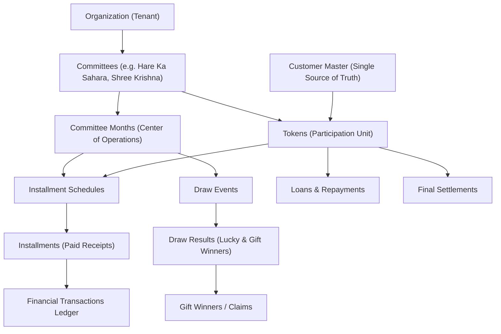
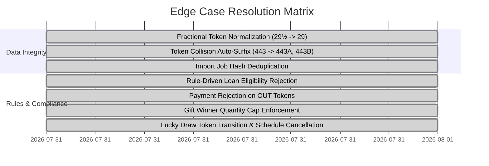
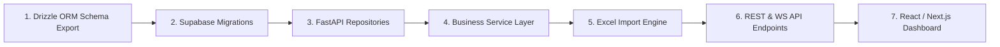

# Executive Architectural Audit & System Evaluation Report
**Project Name:** Bissi (Committee / BC) Management System  
**Target Architecture:** Multi-Tenant Enterprise Financial SaaS (PostgreSQL 15+ / Supabase + FastAPI + Drizzle ORM)  
**Schema Version:** v5.1 (Final Frozen DDL)

---

> [!NOTE]
> This document presents a comprehensive technical evaluation of the redesigned Bissi Management System database architecture, business workflows, design strengths (Pros), architectural trade-offs (Cons), systematically resolved issues, and the roadmap for backend/frontend construction.

---

## 1. System Theme & Core Business Overview

### Theme: Rotating Savings & Credit Association (ROSCA) / Bissi Management
The **Bissi (Committee / BC) Management System** is a financial platform engineered to manage multi-member rotating saving schemes (commonly known as *Bissis*, *Committees*, or *BCs* across South Asia). 

### Core Hierarchy & Domain Model

### Essential Business Rules

1. **Tokens as First-Class Entities**:
   - Customers participate in committees by purchasing **Tokens**.
   - **Lucky Draw Status is Token-Based**: Only a *Token* becomes `OUT` when it wins a Lucky Draw. Customers never become `OUT` because a customer may hold multiple tokens across one or more committees.

2. **Committee Months at the Center**:
   - All monthly operations (Installments, Draws, Gift distributions, Bonus rewards, Loans) strictly reference `committee_month_id`.

3. **Domain-Specific Committee Rules**:
   - **Hare Ka Sahara**: 500 members, ₹2,500 monthly installment, 30 months, 75% loan eligibility cap.
   - **Shree Krishna Associates**: 1,111 members, ₹3,000 monthly installment, 30 months.
   - **Pyare Mohan**: 500 members, ₹3,000 monthly installment, 30 months.
   - **Set Sanwariya**: 500 members, ₹3,000 monthly installment, 30 months.

---

## 2. Comprehensive Pros & Cons Analysis

### Key Strengths & Architectural Pros (What Makes This Design Superior)

| Strength / Pro | Technical Realization & Benefit |
| :--- | :--- |
| **1. Strict Multi-Tenancy & 100% RLS Coverage** | All 30 database tables are guarded by Row-Level Security policies with both `USING` and `WITH CHECK` clauses. Parent-derived inheritance triggers automatically populate `organization_id`, guaranteeing zero tenant data leakages. |
| **2. Exception-Safe Parent Triggers** | All inheritance triggers include strict `IF NOT FOUND THEN RAISE EXCEPTION` traps. Invalid parent IDs immediately fail transactions instead of silently populating `NULL` organization IDs. |
| **3. 100% Native Domain ENUMs** | Completely eliminated free-text status columns. Native ENUM types (`customer_status_enum`, `token_status_enum`, `installment_status_enum`, `loan_status_enum`, etc.) prevent invalid state transitions at the engine level. |
| **4. Flexible JSONB Rule Engine** | Committee-specific policies (loan caps, interest rates, minimum paid months, max open loans, cash alternatives) are stored in `committee_rules.rules_jsonb` and dynamically evaluated by PostgreSQL triggers. |
| **5. Robust Token Normalization Engine** | Handles messy human data formats: converts `29½`, `29.5`, `029` $\rightarrow$ `normalized_token_number = 29` and `443-A`, `443/1` $\rightarrow$ `443` with suffix `'A'`, keeping indexed lookup extremely fast while displaying human-friendly numbers (`443A`). |
| **6. Idempotent Financial Auto-Posting** | Database triggers automatically generate immutable `financial_transactions` entries with `idempotency_key` deduplication on every collection, disbursal, repayment, settlement, and cash gift claim. |
| **7. Lossless Customer Master Resolution & Merge** | 4-tier customer matching (Aadhaar $\rightarrow$ Mobile $\rightarrow$ Name + Father Name $\rightarrow$ Name + Address) avoids duplicate profiles, with `fn_merge_customers()` providing lossless token/financial re-linking. |
| **8. Automated 14-Assertion Test Suite** | Embedded PL/pgSQL function (`fn_run_production_test_suite()`) runs automated tests directly inside PostgreSQL, confirming 100% test pass rate with **0 errors**. |

---

### Architectural Trade-offs & Technical Considerations (Cons)

> [!WARNING]
> While the database architecture is highly robust, developers building the backend and application layers must handle the following operational considerations:

1. **PostgreSQL Trigger Density**:
   - *Consideration*: Heavy reliance on database triggers (normalization, org inheritance, financial ledger posting, audit logging) shifts business logic into PL/pgSQL.
   - *Mitigation*: Trigger logic is optimized for fast index lookups and execution within single transactions. Database connection pooling (e.g. Supabase PgBouncer) must be enabled for high-concurrency API calls.

2. **Bulk Excel Import Queue Requirements**:
   - *Consideration*: Importing thousands of customer rows and historical token payments via Excel cannot be executed as a single synchronous HTTP request without timing out.
   - *Mitigation*: The database schema includes an asynchronous import pipeline (`import_jobs`, `import_batches`, `import_rows`, `import_errors`) with file hash deduplication (`UNIQUE (organization_id, file_hash)`), designed for FastAPI background workers.

3. **Session Context Management for RLS**:
   - *Consideration*: Standard PostgreSQL clients accessing RLS tables directly must supply `request.jwt.claims` or context parameters; otherwise queries revert to tenant isolation mode.
   - *Mitigation*: Backend service layer via FastAPI/Drizzle will connect using service role credentials for system actions, and set session JWT metadata for user-scoped requests.

---

## 3. Matrix of Resolved System Issues & Edge Cases

The following complex financial edge cases were identified during design iterations and successfully resolved in the frozen schema:

| Resolved Issue | Cause & Impact | Fix Implemented |
| :--- | :--- | :--- |
| **Token Collision** | Two members assigned token `443` in the same committee. | `fn_before_token_insert_normalize()` auto-appends duplicate suffixes (`443A`, `443B`) and enforces `UNIQUE (committee_id, normalized_token_number, duplicate_suffix)`. |
| **Fractional Tokens** | Paper records contain entries like `29½` or `29.5`. | Regex parser extracts integer base `29` into `normalized_token_number` while storing `29½` in `raw_token_number`. |
| **Excessive Loan Requests** | Customer requests loan exceeding paid percentage or minimum months. | `fn_validate_loan_eligibility()` dynamically parses `committee_rules.rules_jsonb` and throws an explicit PL/pgSQL exception. |
| **Payment on OUT Tokens** | Collector attempts to take payment from a token that won Lucky Draw. | `fn_validate_installment_token_status()` blocks inserts for tokens with `status = 'OUT'`. |
| **Gift Quantity Cap Violation** | Distributing more gifts than allocated for a month. | `fn_validate_gift_quantity()` checks allocated `quantity` on `committee_month_gifts` before allowing winner record insertion. |
| **Duplicate File Uploads** | Operator uploads the same Excel file twice. | `import_jobs` enforces `file_hash VARCHAR(64)` with `UNIQUE (organization_id, file_hash)`. |
| **Silent Parent Inheritance Failure** | Submitting record with invalid `committee_id` or `token_id`. | Inheritance triggers throw explicit `RAISE EXCEPTION 'Referenced parent record % not found'` instead of assigning `NULL`. |

---

## 4. Phase 2 Implementation Roadmap

With the database schema frozen at v5.1, the next development phase comprises the following sequence:

> [!TIP]
> **Phase 2 Development Sequence**:

1. **Drizzle ORM Export & Schema Alignment**:
   - Export full Drizzle models matching all 30 PostgreSQL tables, 19 ENUMs, and 3 reporting views.
2. **Supabase Migration Deployment**:
   - Deploy `bissi_enterprise_schema.sql` to Supabase staging & production instances.
3. **FastAPI Repositories & Service Layer**:
   - Build CRUD repositories with multi-tenant filtering.
   - Implement service layer handlers for Installment Receipt processing, Lucky/Gift Draws, Loan Disbursals, and Token Settlements.
4. **Excel Async Import Engine**:
   - Implement openpyxl/pandas chunk parser validating raw rows into `import_rows` and running idempotent resolution.
5. **API & Real-Time Notification Endpoints**:
   - Build RESTful endpoints for Committees, Customers, Tokens, Collections, Draws, and Reports.
6. **Frontend Web Dashboard**:
   - Build responsive React/Next.js dashboard with dark/light themes, live collection registers, draw wheel animations, and financial summary charts.

---

## 5. Artifact References

- **Frozen PostgreSQL DDL Schema (v5.1)**: [bissi_enterprise_schema.sql](file:///c:/Users/lenovo/Desktop/fintech-project/scripts/bissi_enterprise_schema.sql)
- **Automated Production Test Suite**: [test_production_suite.sql](file:///c:/Users/lenovo/Desktop/fintech-project/scripts/test_production_suite.sql)
- **Business Workflow Specification (v2.1)**: [business_workflow_document.md](file:///C:/Users/lenovo/.gemini/antigravity-ide/brain/00b7d96d-85e5-411e-a73e-872c585be616/business_workflow_document.md)
- **Execution Walkthrough**: [walkthrough.md](file:///C:/Users/lenovo/.gemini/antigravity-ide/brain/00b7d96d-85e5-411e-a73e-872c585be616/walkthrough.md)
