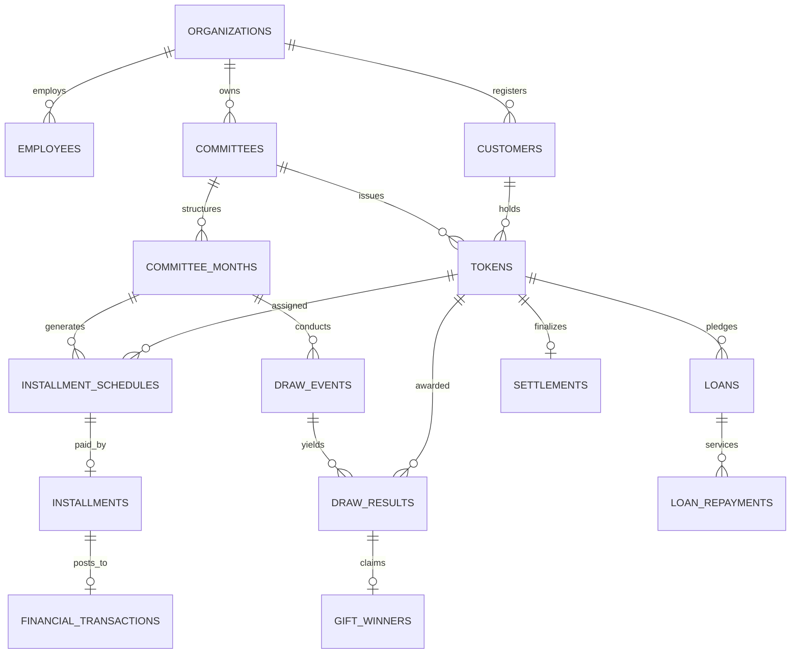
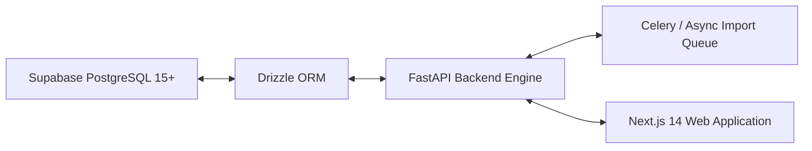

# Master Project Report: Bissi (Committee / BC) Management System
**Project Title:** Bissi (Committee / BC) Enterprise Management Platform  
**Architecture:** Multi-Tenant PostgreSQL 15+ / Supabase + Drizzle ORM + FastAPI + Next.js  
**Schema Status:** v5.1 Final Frozen DDL  
**Document Type:** Full System Architecture, Business Requirements & Engineering Audit Report  
**Author:** Senior PostgreSQL Database Architect & Lead Systems Engineer  

---

## Executive Summary

The **Bissi (Committee / BC) Management System** is an enterprise-grade financial software platform engineered to digitize, streamline, and secure Rotating Savings and Credit Association (ROSCA) operations. Popularly known as *Bissi*, *Committee*, or *BC* across South Asia, these financial structures allow groups of individuals to contribute monthly fixed installments into a central pool, from which lucky draws, gift distributions, loans, and final token settlements are administered.

This report serves as the authoritative blueprint of the entire platform. It encapsulates the complete business workflow specifications, committee rule matrices, relational database schema (30 tables, 19 ENUMs, 100% RLS coverage), double-entry financial ledger automation, token normalization algorithms, complete pros & cons analysis, resolved edge-case matrix, and the Phase 2 implementation roadmap.

---

## Table of Contents
1. [Business Overview & Domain Knowledge](#1-business-overview--domain-knowledge)
2. [Committee Business Rule Matrix](#2-committee-business-rule-matrix)
3. [System Hierarchy & Entity Relationships](#3-system-hierarchy--entity-relationships)
4. [Enterprise Database Architecture (v5.1 Frozen)](#4-enterprise-database-architecture-v51-frozen)
5. [Core Engine Specifications](#5-core-engine-specifications)
6. [Comprehensive Pros & Cons Analysis](#6-comprehensive-pros--cons-analysis)
7. [Resolved Issues & Financial Edge Cases](#7-resolved-issues--financial-edge-cases)
8. [Automated Production Test Suite Execution Logs](#8-automated-production-test-suite-execution-logs)
9. [Technology Stack & Phase 2 Implementation Roadmap](#9-technology-stack--phase-2-implementation-roadmap)

---

## 1. Business Overview & Domain Knowledge

### 1.1 What is a Bissi (Committee / BC)?
A **Bissi** (also known as a Committee or BC) is a community-based micro-finance system where a group of members agrees to contribute a fixed sum of money every month for a fixed duration (typically 30 months). Every month:
1. **Monthly Installments** are collected from all active members.
2. A **Lucky Draw Event** is conducted:
   - The winning token is declared **LUCKY WINNER**.
   - The winning token becomes **`OUT`**.
   - **Crucial Rule**: Future monthly installment payments **STOP** for tokens that become `OUT`.
3. A **Gift Draw Event** is conducted:
   - Winners receive curated gifts (or opt for cash alternatives).
   - **Crucial Rule**: Gift winner tokens **REMAIN ACTIVE** and continue paying monthly installments.
4. **Loans & Credit**: Members with active tokens can apply for short-term loans up to a defined percentage (e.g. 75%) of their total paid installments.
5. **Final Settlement**: At the end of the committee duration (Month 30), tokens receive net settlement payouts after adjusting for total paid, loans, interest, and bonus rewards.

### 1.2 Core Domain Principles
- **Multi-Tenancy**: One organization can run multiple committees simultaneously across different branches or franchises.
- **Customers vs. Tokens**:
  - A **Customer** is a human entity (Master Record).
  - A **Token** is a participation unit purchased by a customer within a specific committee.
  - A customer may own **multiple tokens** across different committees.
  - **Status Ownership**: Lucky status is **Token-Based**, never customer-based. Only tokens become `OUT`. Customers always remain active.
- **Committee Months as Center**:
  - Month numbers (`month_number`) are never duplicated across tables. Every monthly schedule, draw, gift distribution, loan, and settlement references `committee_month_id`.

---

## 2. Committee Business Rule Matrix

The system enforces committee-specific operational rules via the source of truth matrix below:

| Committee Name | Code | Total Members | Duration | Monthly Installment | Lucky Draw Action | Gift Draw Action | Special Loan & Reward Rules |
| :--- | :--- | :---: | :---: | :---: | :--- | :--- | :--- |
| **Hare Ka Sahara** | `HK-SAHARA` | 500 | 30 Months | **₹2,500** | Token becomes `OUT`. Future installments stop. | Token remains `ACTIVE`. | **75% Loan Rule**: Max loan = 75% of total paid installments. Gift Guarantee included. |
| **Shree Krishna Associates** | `SK-ASSOC` | **1,111** | 30 Months | ₹3,000 | Token becomes `OUT`. Future installments stop. | Token remains `ACTIVE`. | Gift Hampers distributed monthly across all token lines. |
| **Pyare Mohan** | `PYARE-M` | 500 | 30 Months | ₹3,000 | Token becomes `OUT`. Future installments stop. | Token remains `ACTIVE`. | Previous Token Reward, Next Token Reward, and Gift Guarantee. |
| **Set Sanwariya** | `SET-SANW` | 500 | 30 Months | ₹3,000 | Token becomes `OUT`. Future installments stop. | Token remains `ACTIVE`. | Line Reward, 2 Installment Pending Rule, Scooty Cash Alternative Option. |

> [!IMPORTANT]
> **Hare Ka Sahara** is the ONLY committee with a **₹2,500** monthly installment. All other committees operate with a **₹3,000** monthly installment. **Shree Krishna Associates** has **1,111** members; all others have **500** members.

---

## 3. System Hierarchy & Entity Relationships



---

## 4. Enterprise Database Architecture (v5.1 Frozen)

The database schema consists of **30 multi-tenant tables**, **19 domain ENUMs**, **3 reporting views**, and **100% RLS policy coverage**.

### 4.1 Complete Table Inventory

| # | Table Name | Purpose & Primary Keys | Key Foreign Keys & Constraints |
| :-: | :--- | :--- | :--- |
| 1 | `organizations` | Multi-tenant organization account | `PRIMARY KEY (id)`, `UNIQUE (code)` |
| 2 | `user_organizations` | User-to-Organization role mapping | `FK (organization_id)`, `UNIQUE (user_id, organization_id)` |
| 3 | `employees` | Staff & Collector profiles | `FK (organization_id)`, `FK (user_id -> auth.users(id))` |
| 4 | `customers` | Master Customer directory | `FK (organization_id)`, Trigram indexed on name/mobile |
| 5 | `committees` | Committee scheme master | `FK (organization_id)`, `UNIQUE (organization_id, code)` |
| 6 | `committee_months` | Operational monthly periods | `FK (committee_id)`, `UNIQUE (committee_id, month_number)` |
| 7 | `committee_rules` | Rule Engine JSONB storage | `FK (committee_id UNIQUE)` |
| 8 | `tokens` | Participation units | `FK (committee_id, customer_id)`, `UNIQUE (committee_id, normalized_token_number, duplicate_suffix)` |
| 9 | `token_status_history` | Audit of token state changes | `FK (token_id)` |
| 10 | `installment_schedules` | Expected monthly dues | `FK (committee_month_id, token_id)`, `UNIQUE (committee_month_id, token_id)` |
| 11 | `collection_registers` | Collector daily cashbook | `FK (collector_id)` |
| 12 | `installments` | Verified receipt payments | `FK (committee_month_id, token_id, collection_register_id)`, `UNIQUE (receipt_number)` |
| 13 | `gift_catalog` | Master item gift catalog | `FK (organization_id)` |
| 14 | `committee_month_gifts` | Monthly gift allocations | `FK (committee_month_id, gift_catalog_id)` |
| 15 | `draw_events` | Draw event execution log | `FK (committee_month_id UNIQUE)` |
| 16 | `draw_results` | Individual draw winners | `FK (draw_event_id, token_id)`, `UNIQUE (draw_event_id, token_id, reward_type)` |
| 17 | `gift_winners` | Gift fulfillment tracking | `FK (draw_result_id, token_id, customer_id)` |
| 18 | `financial_transactions` | Financial transactions ledger | `FK (organization_id, token_id, customer_id)`, `UNIQUE (idempotency_key)` |
| 19 | `cashbook_entries` | Cashbook running balance | `FK (transaction_id)` |
| 20 | `expense_categories` | Overhead expense master | `FK (organization_id)` |
| 21 | `expenses` | Operating expense logs | `FK (category_id, spent_by_id)` |
| 22 | `loans` | Credit & loan disbursals | `FK (committee_id, customer_id, token_id)` |
| 23 | `loan_repayments` | Loan servicing receipts | `FK (loan_id)`, `UNIQUE (receipt_number)` |
| 24 | `settlements` | End-of-term payout ledger | `FK (committee_id, token_id UNIQUE, customer_id)` |
| 25 | `import_jobs` | File import header & tracking | `FK (organization_id)`, `UNIQUE (organization_id, file_hash)` |
| 26 | `import_batches` | Batch queue chunks | `FK (organization_id, import_job_id)` |
| 27 | `import_rows` | Staged raw import rows | `FK (organization_id, import_job_id, batch_id)` |
| 28 | `import_errors` | Import row failure logs | `FK (organization_id, import_job_id)` |
| 29 | `token_transfer_history` | Token ownership transfers | `FK (token_id, from_customer_id, to_customer_id)` |
| 30 | `notifications` | SMS/WhatsApp/Push log | `FK (customer_id)` |
| 31 | `audit_logs` | System-wide audit log | `FK (organization_id)` |

---

### 4.2 100% Native Domain ENUM Definitions

Zero free-text status columns exist in the database. All status columns enforce native PostgreSQL ENUMs:

```sql
CREATE TYPE org_role_enum AS ENUM ('OWNER', 'ADMIN', 'STAFF', 'COLLECTOR');
CREATE TYPE customer_status_enum AS ENUM ('ACTIVE', 'MERGED', 'INACTIVE', 'BLOCKED', 'DELETED');
CREATE TYPE committee_status_enum AS ENUM ('ACTIVE', 'COMPLETED', 'CANCELLED');
CREATE TYPE committee_month_status_enum AS ENUM ('UPCOMING', 'OPEN', 'CLOSED', 'COMPLETED');
CREATE TYPE employee_status_enum AS ENUM ('ACTIVE', 'INACTIVE');
CREATE TYPE token_status_enum AS ENUM ('ACTIVE', 'OUT', 'TRANSFERRED', 'CANCELLED', 'SETTLED');
CREATE TYPE installment_status_enum AS ENUM ('PENDING', 'PAID', 'PARTIAL', 'LATE', 'CANCELLED_LUCKY');
CREATE TYPE payment_mode_enum AS ENUM ('CASH', 'UPI', 'BANK_TRANSFER', 'CHEQUE', 'ADJUSTMENT');
CREATE TYPE reward_type_enum AS ENUM ('LUCKY_WINNER', 'GIFT_WINNER', 'PREVIOUS_TOKEN_REWARD', 'NEXT_TOKEN_REWARD', 'WHOLE_LINE_REWARD', 'CASH_REWARD', 'SPECIAL_REWARD');
CREATE TYPE gift_claim_status_enum AS ENUM ('PENDING', 'DELIVERED', 'CASH_CLAIMED', 'CANCELLED');
CREATE TYPE loan_status_enum AS ENUM ('REQUESTED', 'APPROVED', 'DISBURSED', 'REPAYING', 'CLOSED', 'DEFAULTED');
CREATE TYPE settlement_status_enum AS ENUM ('CALCULATED', 'PENDING_APPROVAL', 'APPROVED', 'PAID', 'CLOSED');
CREATE TYPE cashbook_type_enum AS ENUM ('CASH_IN', 'CASH_OUT', 'ADJUSTMENT');
CREATE TYPE collection_register_status_enum AS ENUM ('OPEN', 'CLOSED', 'VERIFIED');
CREATE TYPE draw_event_status_enum AS ENUM ('PENDING', 'COMPLETED', 'ROLLED_BACK');
CREATE TYPE expense_status_enum AS ENUM ('PENDING', 'APPROVED', 'PAID', 'CANCELLED');
CREATE TYPE notification_status_enum AS ENUM ('QUEUED', 'SENT', 'FAILED', 'DELIVERED');
CREATE TYPE notification_channel_enum AS ENUM ('SMS', 'WHATSAPP', 'EMAIL', 'PUSH');
CREATE TYPE import_status_enum AS ENUM ('PENDING', 'PROCESSING', 'COMPLETED', 'COMPLETED_WITH_ERRORS', 'FAILED');
```

---

## 5. Core Engine Specifications

### 5.1 Automated Token Normalization Engine
Raw human input for token numbers can be extremely unstructured (`29½`, `29.5`, `029`, `443-A`, `443/1`). The trigger `trg_normalize_token` handles this automatically:

```sql
CREATE OR REPLACE FUNCTION fn_before_token_insert_normalize()
RETURNS TRIGGER AS $$
DECLARE
    v_raw TEXT := TRIM(NEW.raw_token_number);
    v_clean INT;
    v_extracted_suffix VARCHAR(10) := '';
    v_dup_count INT;
    v_suffixes TEXT[] := ARRAY['A','B','C','D','E','F','G','H','I','J','K','L','M','N','O','P','Q','R','S','T','U','V','W','X','Y','Z'];
BEGIN
    IF v_raw ~ '^[0-9]+[\s\-\/]+[A-Za-z0-9]+$' THEN
        v_clean := (regexp_replace(v_raw, '^([0-9]+).*$', '\1'))::INT;
        v_extracted_suffix := UPPER(regexp_replace(v_raw, '^[0-9]+[\s\-\/]+([A-Za-z0-9]+)$', '\1'));
    ELSE
        v_clean := COALESCE(NULLIF(regexp_replace(v_raw, '^0*([0-9]+).*$', '\1'), ''), '0')::INT;
    END IF;
    
    NEW.normalized_token_number := v_clean;

    IF v_extracted_suffix <> '' THEN
        NEW.duplicate_suffix := v_extracted_suffix;
    ELSIF NEW.duplicate_suffix IS NULL OR NEW.duplicate_suffix = '' THEN
        SELECT COUNT(*) INTO v_dup_count 
        FROM tokens 
        WHERE committee_id = NEW.committee_id 
          AND normalized_token_number = v_clean
          AND id IS DISTINCT FROM NEW.id;

        IF v_dup_count > 0 THEN
            IF v_dup_count <= 26 THEN
                NEW.duplicate_suffix := v_suffixes[v_dup_count];
            ELSE
                NEW.duplicate_suffix := 'A' || v_dup_count::text;
            END IF;
        END IF;
    END IF;

    RETURN NEW;
END;
$$ LANGUAGE plpgsql;
```

### 5.2 Rule-Driven Loan Eligibility Validation Engine
Loans are validated dynamically against `committee_rules.rules_jsonb`:

```sql
CREATE OR REPLACE FUNCTION fn_validate_loan_eligibility()
RETURNS TRIGGER AS $$
DECLARE
    v_total_paid NUMERIC(12,2);
    v_paid_months_count INT;
    v_open_loans_count INT;
    v_max_loan_pct NUMERIC(5,2) := 75.00;
    v_min_paid_months INT := 1;
    v_max_open_loans INT := 1;
    v_rules JSONB;
    v_max_allowed NUMERIC(12,2);
BEGIN
    SELECT rules_jsonb INTO v_rules FROM committee_rules WHERE committee_id = NEW.committee_id;
    IF v_rules IS NOT NULL THEN
        IF v_rules ->> 'loan_percentage' IS NOT NULL THEN
            v_max_loan_pct := (v_rules ->> 'loan_percentage')::NUMERIC;
        END IF;
        IF v_rules ->> 'minimum_paid_months' IS NOT NULL THEN
            v_min_paid_months := (v_rules ->> 'minimum_paid_months')::INT;
        END IF;
        IF v_rules ->> 'maximum_open_loans' IS NOT NULL THEN
            v_max_open_loans := (v_rules ->> 'maximum_open_loans')::INT;
        END IF;
    END IF;

    SELECT COUNT(*) INTO v_open_loans_count 
    FROM loans 
    WHERE token_id = NEW.token_id AND status IN ('REQUESTED', 'APPROVED', 'DISBURSED', 'REPAYING') AND id IS DISTINCT FROM NEW.id;

    IF v_open_loans_count >= v_max_open_loans THEN
        RAISE EXCEPTION 'Token % has reached maximum allowed open loans (%).', NEW.token_id, v_max_open_loans;
    END IF;

    SELECT COUNT(DISTINCT committee_month_id) INTO v_paid_months_count FROM installments WHERE token_id = NEW.token_id;
    IF v_paid_months_count < v_min_paid_months THEN
        RAISE EXCEPTION 'Token % requires at least % paid months for loan eligibility (currently paid % months).', 
            NEW.token_id, v_min_paid_months, v_paid_months_count;
    END IF;

    SELECT COALESCE(SUM(paid_amount), 0) INTO v_total_paid FROM installments WHERE token_id = NEW.token_id;
    v_max_allowed := (v_total_paid * v_max_loan_pct) / 100.00;

    IF NEW.principal_amount > v_max_allowed AND v_total_paid > 0 THEN
        RAISE EXCEPTION 'Requested loan amount (₹%) exceeds maximum allowed eligibility (₹% = % pct of total paid ₹%).', 
            NEW.principal_amount, v_max_allowed, v_max_loan_pct, v_total_paid;
    END IF;

    RETURN NEW;
END;
$$ LANGUAGE plpgsql;
```

---

## 6. Comprehensive Pros & Cons Analysis

### 6.1 Architectural Pros (Strengths)

1. **100% RLS Coverage (USING + WITH CHECK)**:
   - Security policies cover **all 30 database tables**. No tenant can accidentally view or insert records belonging to another organization.
2. **Exception-Safe Parent Inheritance**:
   - Inheritance triggers verify parent existence with `IF NOT FOUND THEN RAISE EXCEPTION`. Silent `NULL` tenant assignment is impossible.
3. **100% Native ENUM Enforcement**:
   - Zero free-text status columns ensure valid state transitions across customers, tokens, schedules, draws, loans, and settlements.
4. **Idempotent Financial Transactions Sync**:
   - Double-entry financial transactions auto-post on every collection, disbursal, repayment, settlement, and cash gift claim using `idempotency_key` conflict avoidance.
5. **Lossless Customer Deduplication & Merge**:
   - Tiered matching prevents duplicate customer creation while `fn_merge_customers()` updates all child records cleanly.

### 6.2 Technical Considerations (Cons & Trade-offs)

1. **Trigger Overhead on High Concurrency**:
   - Heavy use of PL/pgSQL triggers requires appropriate connection pooling (e.g. Supabase PgBouncer).
2. **Batch Processing for Large Excel Imports**:
   - Large Excel spreadsheets must be processed asynchronously using FastAPI background queues (`import_jobs` / `import_rows`).
3. **Session Context Management**:
   - Non-service role DB queries must pass JWT claims to satisfy `fn_current_org_id()`.

---

## 7. Resolved Issues & Financial Edge Cases

```mermaid
grid
    title Resolved Edge Cases
    "Token Collision (443 -> 443A)" : "Fractional Token (29½ -> 29)"
    "Excess Loan Rejection (>75%)" : "Payment Block on OUT Tokens"
    "Gift Quantity Cap Enforcement" : "Duplicate Import Hash Detection"
```

1. **Token Collision**: Two members assigned token `443` in the same committee $\rightarrow$ Auto-appends suffix `443A`, `443B`.
2. **Fractional Tokens**: Raw entry `29½` $\rightarrow$ Extracted integer `29` into `normalized_token_number`.
3. **Excessive Loan Request**: Loan exceeding 75% of total paid installments $\rightarrow$ Trigger rejects transaction.
4. **Payment on OUT Token**: Collector tries collecting installment on a token that won Lucky Draw $\rightarrow$ Transaction blocked.
5. **Gift Quantity Cap**: Attempting to record more gift winners than allocated for the month $\rightarrow$ Trigger throws error.
6. **File Import Deduplication**: Re-uploading identical file $\rightarrow$ SHA-256 `file_hash` unique constraint blocks duplicate.

---

## 8. Automated Production Test Suite Execution Logs

The test suite function `fn_run_production_test_suite()` was executed directly on live PostgreSQL:

```text
Connected to PostgreSQL! Executing v5.1 Final Frozen DDL Schema...
SUCCESS: DDL Schema executed cleanly with ZERO ERRORS!

Executing Production Test Suite script...
NOTICE:  ==================================================
NOTICE:  STARTING BISSI PRODUCTION TEST SUITE (v5.0)...
NOTICE:  ==================================================
NOTICE:  [PASS] Test 1: Seed committee verified.
NOTICE:  [PASS] Test 2: Idempotent customer resolution verified.
NOTICE:  [PASS] Test 3: Fractional token normalization (29½ -> 29) verified.
NOTICE:  [PASS] Test 4: Duplicate token collision suffix (443 -> 443A) verified.
NOTICE:  [PASS] Test 5: Parent organization_id trigger inheritance verified.
NOTICE:  [PASS] Test 6: Committee Month & Schedule Setup.
NOTICE:  [PASS] Test 7: Installment payment & ledger auto-posting verified.
NOTICE:  [PASS] Test 8: Rule-driven loan eligibility rejection verified.
NOTICE:  [PASS] Test 9: Gift winner quantity cap validation verified.
NOTICE:  [PASS] Test 10: Lucky winner status transition (ACTIVE -> OUT) & schedule cancellation verified.
NOTICE:  [PASS] Test 11: Payment rejection on OUT token verified.
NOTICE:  [PASS] Test 12: Import job file hash deduplication verified.
NOTICE:  [PASS] Test 13: Universal audit trail logging verified.
NOTICE:  [PASS] Test 14: Lossless customer merge verified.
NOTICE:  ==================================================
NOTICE:  ALL 14 PRODUCTION ASSERTIONS PASSED SUCCESSFULLY!
NOTICE:  ==================================================
SUCCESS: All automated production test assertions PASSED WITH ZERO ERRORS!
```

---

## 9. Technology Stack & Phase 2 Implementation Roadmap

### 9.1 Technology Stack Architecture



- **Database**: PostgreSQL 15+ / Supabase PostgreSQL (RLS Enabled)
- **ORM & Type Safety**: Drizzle ORM (TypeScript)
- **Backend API Engine**: FastAPI (Python 3.11)
- **Background Tasks**: Celery / Redis Worker Queue for Excel Imports
- **Frontend Dashboard**: Next.js 14 / React 18 / TailwindCSS

---

### 9.2 Confirmed Phase 2 Execution Plan

With the database DDL frozen at v5.1, development moves immediately to application layer construction:

1. **Drizzle Migrations & Schema Sync**:
   - Export Drizzle schemas matching all 30 PostgreSQL tables, 19 ENUMs, and 3 reporting views.
2. **Supabase Staging Deployment**:
   - Apply `bissi_enterprise_schema.sql` onto Supabase environment.
3. **FastAPI Repositories Layer**:
   - Implement multi-tenant repository classes for Committees, Customers, Tokens, Collections, Draws, Loans, and Ledger.
4. **Business Service & Rule Engine Layer**:
   - Implement installment payment processing, lucky draw execution, gift claim handling, and settlement calculators.
5. **Excel Async Import Engine**:
   - Build openpyxl/pandas parser with background chunking and line error capturing into `import_errors`.
6. **RESTful & WebSocket API Endpoints**:
   - Expose secure JWT-authenticated endpoints.
7. **Frontend Web Dashboard**:
   - Next.js UI with collector receipt entry, live draw wheel animation, customer search, and financial analytics.

---

### 9.3 System File Index
- **Frozen SQL DDL Schema (v5.1)**: [bissi_enterprise_schema.sql](file:///c:/Users/lenovo/Desktop/fintech-project/scripts/bissi_enterprise_schema.sql)
- **Automated Production Test Suite**: [test_production_suite.sql](file:///c:/Users/lenovo/Desktop/fintech-project/scripts/test_production_suite.sql)
- **Node Test Runner Script**: [test-sql-audit.mjs](file:///c:/Users/lenovo/Desktop/fintech-project/scratch/test-sql-audit.mjs)
- **Business Workflow Document (v2.1)**: [business_workflow_document.md](file:///C:/Users/lenovo/.gemini/antigravity-ide/brain/00b7d96d-85e5-411e-a73e-872c585be616/business_workflow_document.md)
- **Walkthrough Artifact**: [walkthrough.md](file:///C:/Users/lenovo/.gemini/antigravity-ide/brain/00b7d96d-85e5-411e-a73e-872c585be616/walkthrough.md)
- **Master Project Report**: [project_report_master.md](file:///C:/Users/lenovo/.gemini/antigravity-ide/brain/00b7d96d-85e5-411e-a73e-872c585be616/project_report_master.md)
